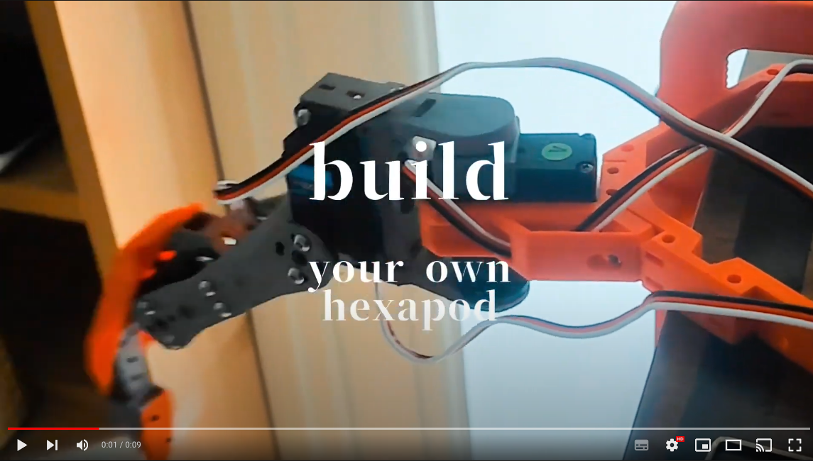
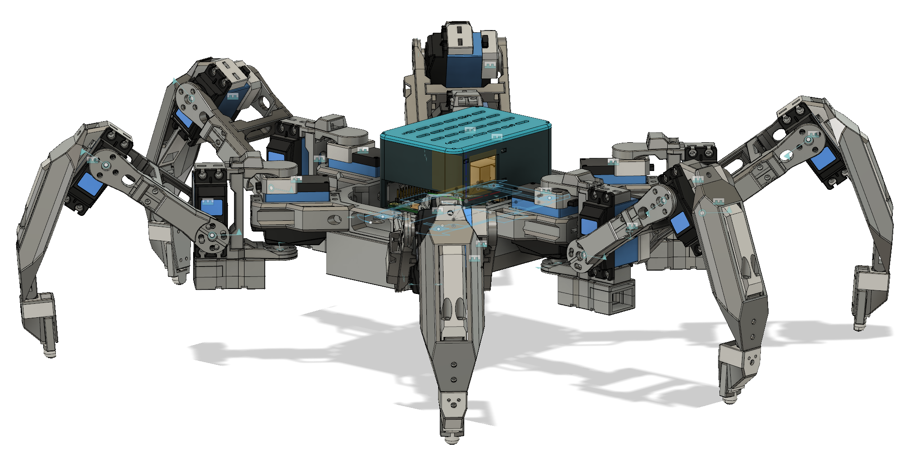

# Spider Robot Tutorials

Welcome to the Spider Robot Tutorials repository! This collection of tutorials is designed to help you build, program, and control a hexapod robot. We'll cover everything from the basics of robot mechanics and design to more advanced topics like inverse kinematics and control algorithms. Whether you're a beginner or a seasoned roboticist, there's something here for everyone.

## Table of Contents
- Introduction to Hexapod Robotics
- Selecting Tools, Hardware Components & Designing 3D Printed Parts - TBD
- [Servo Calibration](tutorial_servo_calibration/README.md)
- [Controlling Your Robot Using USB or Bluetooth HID Devices]()
- Programming the Hexapod: Basics - TBD
- [Inverse Kinematics for Spider Robot Legs](tutorial_inverse_kinematics/README.md)
- [Forward Kinematics for Spider Robot Legs](tutorial_forward_kinematics/README.md)
- Gait patterns - TBD
- Control Algorithms and Optimization - TBD
- Adding Sensors and Interactivity - TBD
- AI - TBD

## Getting Started
To get started with the Spider Robot Tutorials, simply clone this repository or download the tutorials as a ZIP file. Each tutorial folder contains a README.md file, which serves as the main tutorial document. Follow the instructions provided in the README.md files, and you'll be on your way to building and programming your own hexapod robot!

## Contributing
We welcome contributions to the Hexapod Robotics Tutorials repository! If you have a new tutorial idea, an improvement to an existing tutorial, or any other suggestions, please feel free to open an issue or submit a pull request.

## License
The content in this repository is licensed. For more information about the license terms and conditions, please refer to the [LICENSE](LICENSE) file in this repository.

Happy building!