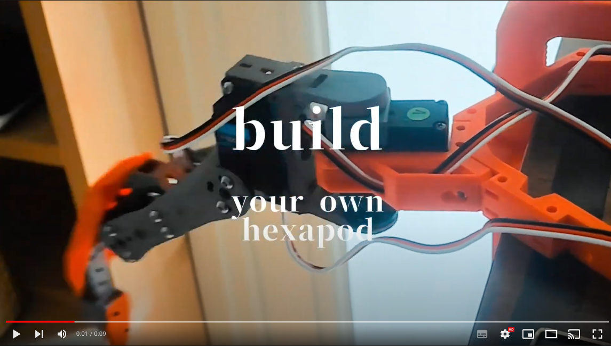
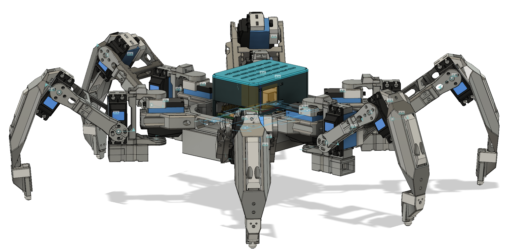
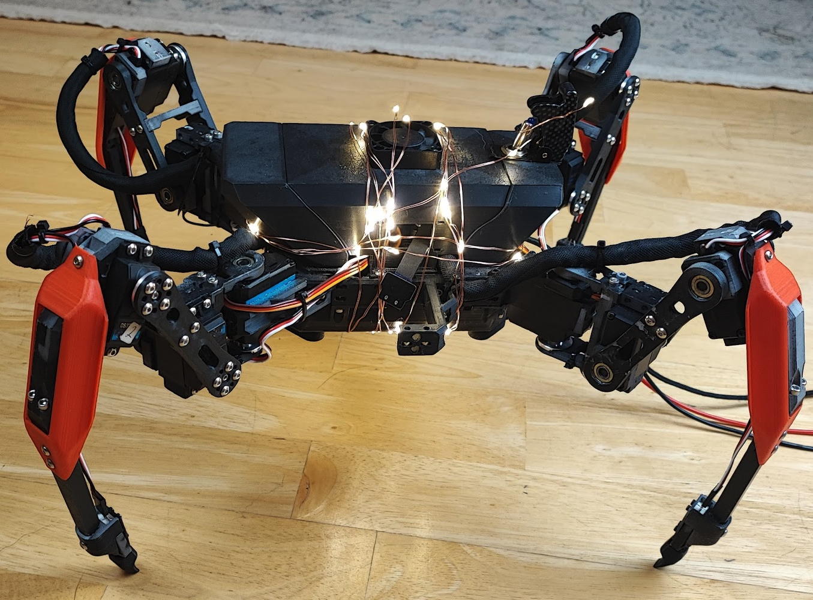

# Spider Robot Tutorials

## Tutorials on Catch IT

Read the companion articles on [Catch IT — Robert Meisner's website](https://catchit.pl/). These link back to the source code and include build context, tests and limitations.

- [Building My 3D-Printed Hexapod](https://catchit.pl/blog/building-3d-printed-hexapod-spider-robot/)
- [How the Hexapod Control Layers Fit Together](https://catchit.pl/blog/hexapod-servo-calibration-forward-inverse-kinematics/)
- [Building a Hexapod: Tools, Hardware and 3D-Printed Parts](https://catchit.pl/blog/hexapod-build-guide-tools-hardware-and-3d-printed-parts/)
- [Calibrating Hexapod Servos with a Servo Tester](https://catchit.pl/blog/calibrating-hexapod-servos-with-a-servo-tester/)
- [Controlling a Hexapod with a HID Gamepad](https://catchit.pl/blog/controlling-a-hexapod-with-a-hid-gamepad/)
- [Inverse Kinematics for a Hexapod Leg](https://catchit.pl/blog/inverse-kinematics-for-a-hexapod-leg/)
- [Forward Kinematics for a Hexapod Leg](https://catchit.pl/blog/forward-kinematics-for-a-hexapod-leg/)
- [Controlling One Hexapod Leg](https://catchit.pl/blog/controlling-one-hexapod-leg/)

Welcome to the Spider Robot Tutorials repository! This collection of tutorials is designed to help you build, program, and control a hexapod robot. We'll cover everything from the basics of robot mechanics and design to more advanced topics like inverse kinematics and control algorithms. Whether you're a beginner or a seasoned roboticist, there's something here for everyone.

## Table of Contents
- Introduction to Hexapod Robotics
- [Tools, Hardware Components, and 3D Printed Parts](tutorial_tools_hardware_3d_parts_spider_robot/README.md)
- [Servo Calibration](tutorial_servo_calibration/README.md)
- [Controlling Your Robot Using USB or Bluetooth HID Devices](tutorial_controlling_robot_using_hid/README.md)
- [Programming the Hexapod: Basics](tutorial_controll_one_leg/README.md)
- [Inverse Kinematics for Spider Robot Legs](tutorial_inverse_kinematics/README.md)
- [Forward Kinematics for Spider Robot Legs](tutorial_forward_kinematics/README.md)
- Gait patterns - TBD
- Control Algorithms and Optimization - TBD
- Adding Sensors and Interactivity - TBD
- Artificial Intelligence - TBD

## Getting Started
To get started with the Spider Robot Tutorials, simply clone this repository or download the tutorials as a ZIP file. Each tutorial folder contains a README.md file, which serves as the main tutorial document. Follow the instructions provided in the README.md files, and you'll be on your way to building and programming your own hexapod robot!

## Contributing
We welcome contributions to the Hexapod Robotics Tutorials repository! If you have a new tutorial idea, an improvement to an existing tutorial, or any other suggestions, please feel free to open an issue or submit a pull request.

## License
The content in this repository is licensed. For more information about the license terms and conditions, please refer to the [LICENSE](LICENSE) file in this repository.

Happy building!