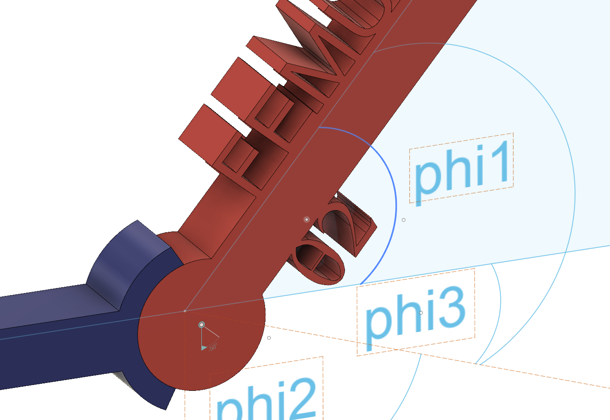
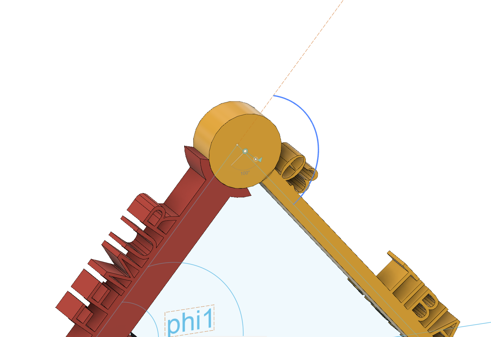
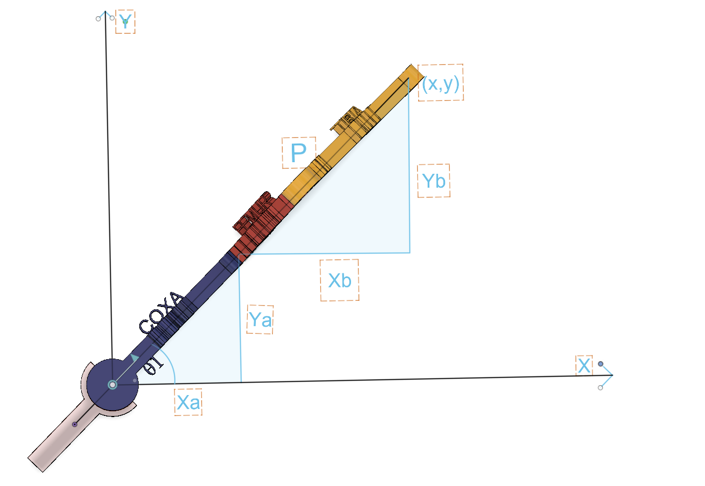
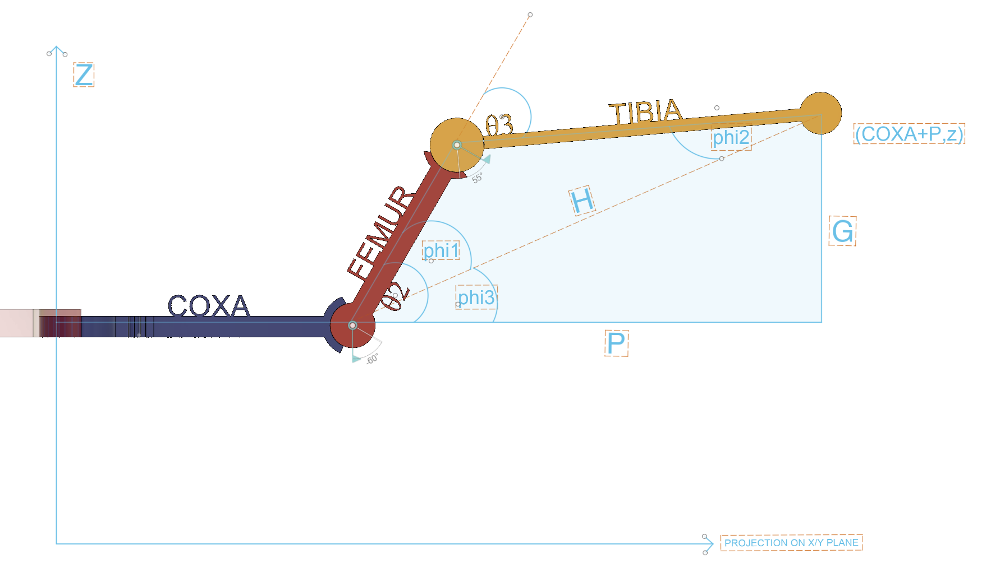

Hello, fellow code explorers and welcome to the first episode of 'Robert Robo-Workshop'! I'm your host, Robert Meisner, and I'm thrilled to invite you on a captivating journey as we build a mesmerizing spider robot from scratch! That's right, in this spectacular series, we'll be delving into the magical world of robotics, DIY, and hands-on workshops to create our very own eight-legged marvel.

Now, if you think that I'm new to this realm, you're absolutely right! This is my first-ever robotics project from scratch, but worry not, because together we'll learn, grow, and overcome every challenge that comes our way. Throughout this series, we'll be diving into fascinating topics such as mechanical design, electronics, coding, and much more.

Today's enchanting adventure begins with exploring the secrets of Inverse Kinematics, where we'll learn how our spider robot will move its legs to traverse its surroundings gracefully. Are you ready to embark on this fantastical voyage? If so, then buckle up, hit that like button, and let's get started!"
## Resources

This repository includes a [Jupyter Notebook](inverse_kinematics_code.ipynb) that contains the code and visualizations for the inverse kinematics tutorial. 

Additionally, a [Fusion 360 file](Hexapod_Leg_Fusion360.f3d) is provided for a 3D model of the hexapod leg, which can be used for visualization and further exploration of the problem.

# Inverse Kinematics for a Spider Robot Leg

In this tutorial, we'll learn how to write a `SpiderLeg` class to perform 
inverse kinematics calculations for a spider robot leg. 
We'll start by discussing the knowledge needed, such as trigonometry, 
and then we'll dive into the implementation details with examples. 

I was inspired by the MakeYourPet project. The MakeYourPet project is an excellent resource for anyone interested in building a hexapod robot at home using a 3D printer and some basic components. The creators of the project provide all the necessary software, STL files, and a detailed description of the electronic components required to assemble the hexapod. They also offer step-by-step instructions on how to put everything together and control the hexapod using an old Android phone.

The MakeYourPet project is perfect for those who want to build a hexapod without diving too deep into the intricacies of robotics. The community behind the project is supportive and can help you through any challenges you might encounter during the build process. If you're interested in building your own hexapod, I highly recommend checking out the MakeYourPet GitHub repository and joining their Discord server for guidance and support.

## Prerequisites

Before we get started, make sure you have a basic understanding of the following concepts:

1. High school trigonometry (projectiona, sine, cosine, tangent, and their inverse functions)
2. Coordinate systems (Cartesian and polar)
3. Vectors and vector operations
4. Basic programming concepts (variables, functions, loops, and conditional statements)

## Inverse Kinematics

Inverse kinematics is a method used in robotics to calculate 
the joint angles required to achieve a specific target position in the workspace. 
The opposite of inverse kinematics is forward kinematics, 
which calculates the position of the end effector (e.g., the tip of a robot arm or leg) given the joint angles.

In the case of our spider robot leg, we have three joints: the coxa (hip), femur (thigh), and tibia (shin). 
Each joint has an associated angle, which we'll call `theta1`, `theta2`, and `theta3`. Our goal is to determine the values of these angles that will place the leg's end effector (the foot) at a desired target position `(x, y, z)`.

## The SpiderLeg Class

Now that we have a basic understanding of inverse kinematics, let's dive into the implementation of the `SpiderLeg` class. The class will handle the following tasks:

1. Store the leg's joint angles and segment lengths (coxa, femur, and tibia)
2. Calculate the inverse kinematics to determine the joint angles required to reach a target position
3. Calculate the forward kinematics to determine the end effector position given the joint angles
4. Validate and normalize joint angles to ensure they are within the leg's range of motion


```python
class SpiderLeg:
    def __init__(self, name, COXA, FEMUR, TIBIA):
        self.name = name
        self.COXA = COXA
        self.FEMUR = FEMUR
        self.TIBIA = TIBIA
        self.theta1 = 0.
        self.theta2 = 0.
        self.theta3 = 0.
        self.joints = self.forwardKinematics()

    def inverseKinematics(self, target=None):
        # Your inverse kinematics implementation here
        pass

    def forwardKinematics(self, angles=None):
        # Your forward kinematics implementation here
        pass
```

In the example above, we have defined a simplified SpiderLeg class that represents a single leg of a spider robot. The class includes the following elements:

The __init__ method initializes the class with a name, segment lengths (COXA, FEMUR, and TIBIA), and initial joint angles (theta1, theta2, and theta3). The forwardKinematics method is called to calculate the initial joint positions.

The inverseKinematics method is a placeholder for the actual implementation of inverse kinematics calculations. When given a target position, this method should compute the joint angles (theta1, theta2, and theta3) required to reach the target.

The forwardKinematics method is a placeholder for the actual implementation of forward kinematics calculations. When given a set of joint angles (theta1, theta2, and theta3), this method should calculate the resulting end-effector (foot) position in the 3D space.

This simplified structure provides a foundation for implementing the inverse and forward kinematics algorithms. You can extend the class by adding more functionality, such as methods to control the servos, update the joint angles, or visualize the leg movement.

## Disclaimers

Before we dive into the explanation of the spider leg model, it's important to note that the actual structure and movement of a spider leg in nature are far more complex than our simplified representation. In this tutorial, we are using a basic mechanical model with three segments and three joint angles to help us understand the fundamental concepts of leg movement and inverse kinematics. Keep in mind that real spider legs have more intricate joint structures, muscle systems, and movement patterns, and our model serves as an approximation for educational purposes. 

Please also note that the approach presented in this tutorial is a simplified, naive method for solving inverse kinematics. In robotics and more advanced applications, there are more sophisticated methods used for inverse kinematics, such as the Denavit-Hartenberg (D-H) method, the Jacobian method, or the Cyclic Coordinate Descent (CCD) method. These methods offer more accurate and efficient ways to solve inverse kinematics, especially for more complex robotic systems. However, for the purpose of this tutorial and for a better understanding of the basic concepts, I have chosen a simplified approach.

## Understanding the Geometry:Perspective Views, Top and Side


In this perspective view of the spider leg, we can appreciate the overall leg structure and the relationships between its components. The leg is composed of three main segments: the coxa, femur, and tibia. Each segment connects to another at a joint, allowing the leg to move in a coordinated manner.

The coxa is the first segment, connecting the leg to the spider's body. It is responsible for the leg's horizontal rotation, controlled by the angle θ1. Moving on from the coxa, we have the femur segment. The femur is the second, longer segment, which primarily controls the leg's vertical movement. Finally, we have the tibia, the third segment, which extends or retracts the leg in relation to the femur.

To better understand how these segments work together, let's take a closer look at angle θ1. As mentioned earlier, θ1 determines the horizontal orientation of the leg. It is the angle between the coxa and the X-axis, controlling the leg's rotation on a horizontal plane.


θ2 is the angle at the coxa-femur joint, which determines the leg's vertical position. It is responsible for raising or lowering the leg and is mainly influenced by the femur segment's length and orientation.


θ3 is the angle between the femur and tibia segments. It controls the leg's extension or retraction, allowing the spider to reach farther or pull the leg closer to its body. This angle is essential for adjusting the leg's position and maintaining stability during movement.


By understanding the relationships between the coxa, femur, tibia, and the angles θ1, θ2, and θ3, we can better appreciate the complex yet elegant kinematics of a spider leg and how inverse kinematics can be used to calculate the necessary joint angles for achieving specific leg positions.

Alright, now let's have a look at the top view of the spider leg. 

From this perspective, we can clearly see how the leg extends horizontally on the X-Y plane. 
The coxa segment connects the leg to the spider's body, and its length can be represented as the distance between the body joint and the coxa joint. 
By projecting the coxa length onto the X and Y axes, we can calculate the Xa and Ya values, which are the Coxa X-projection and Coxa Y-projection, respectively.

From this top view, we can observe how the joint angle θ1 determines the leg's position in the X-Y plane. 
Keep in mind that θ1 is the angle between the coxa and the X-axis. 
The other joint angles, θ2 and θ3, which control the orientation of the femur and tibia segments, are not visible from the top view.


In this view, we can also see some of the auxiliary variables we will use to calculate θ2 and θ3. 
Specifically, Xa and Ya represent the projections of the coxa segment along the X and Y axes, respectively. 
By calculating Xa and Ya, we can determine the starting point of the femur segment, which then helps us to calculate P, the projection of Xb on the X-axis.

Now let's move on to the side view, where we can better understand the roles of θ2, θ3, and the other variables.

In the side view, we can further analyze the relationship between θ2, θ3, and the leg segments, along with the auxiliary variables H, G, P, phi1, phi2, and phi3.
First, let's look at H, G, and P. In this view, H is the length of the hypotenuse of a right-angled triangle formed by the femur and tibia segments. 
G is the absolute value of the Z coordinate, representing the vertical distance between the coxa-femur joint and the target position. 
P, as mentioned earlier, is the projection of Xb on the X-axis.

Now let's discuss phi1, phi2, and phi3. 
These angles are used as intermediate steps in calculating θ2 and θ3. 
Phi1 is the angle formed by the femur, tibia, and H, while phi2 is the angle between the tibia and H. 
Phi3 is the angle between the horizontal plane (formed by the X and Y axes) and the vertical plane containing the tibia segment.

I chose the angles phi1, phi2, and phi3 to assist in calculating the theta angles for our spider leg. These angles were specifically chosen because they help us break down the problem into manageable parts, using well-known trigonometric functions and rules.
It's important to note that you can choose other angles or methods to calculate the theta angles, depending on your specific problem or the way you want to approach the inverse kinematics. The key is to find an approach that makes the calculations more straightforward and easier to understand.
In our case, we used phi1, phi2, and phi3 because they allowed us to form right-angled triangles and apply trigonometric functions like sine, cosine, and tangent. This made it easier to calculate the required joint angles for the spider leg. Remember, the goal is to find an approach that works for your specific problem and makes the calculations more manageable.


From the side view, we can observe how θ2 and θ3 control the leg's vertical position and extension. 
θ2 is primarily responsible for the leg's vertical movement, while θ3 controls the leg's extension or retraction in relation to the femur. 
By understanding the relationships between these angles and the auxiliary variables, we can gain a deeper insight into the spider leg's kinematics and the role of inverse kinematics in achieving the desired leg positions.

Now that we have a good understanding of the spider leg's structure from different views, let's dive into the calculation process that helps us determine the required joint angles to reach a specific target position. 
This process, known as inverse kinematics, is crucial for simulating the movement of the spider leg and controlling it in a precise manner.

In the next section, we will explore the mathematical concepts and trigonometric formulas that play a key role in solving the inverse kinematics problem for our spider leg model. 
We will break down each step of the calculation process, explaining the reasoning behind the use of specific trigonometric functions and rules. 
Even if you're not familiar with trigonometry, don't worry! We'll make sure to explain everything in a way that is easy to understand and follow.

So, get ready to dive into the fascinating world of inverse kinematics and see how mathematics can bring our simplified spider leg to life!

## Basic Trigonometry and Triangular Laws Review

First, let's recall some basic trigonometric functions and rules:

**Sine (sin)** - The ratio of the length of the side opposite the angle to the length of the hypotenuse in a right-angled triangle.
$$sin(\theta)=\frac{opposite}{hypotenuse}$$
To calculate the actual angle using sine, you will need to use the inverse sine function, also known as arcsine ($sin^-1$ or asin). 
The arcsine function helps you find the angle when you know the sine value. 
The formula for finding the angle using arcsine is:
$$\theta = arcsin(\frac{opposite}{hypotenuse})$$

**Cosine (cos)** - The cosine of an angle in a right-angled triangle is defined as the ratio of the length of the adjacent side to the length of the hypotenuse. 
Mathematically, it can be represented as:
$$cos(\theta) = \frac{adjacent}{hypotenuse}$$
To calculate the actual angle using cosine, you will need to use the inverse cosine function, also known as arccosine (cos^(-1) or acos). 
The arccosine function helps you find the angle when you know the cosine value. 
The formula for finding the angle using arccosine is:
$$\theta = arccos(\frac{adjacent}{hypotenuse})$$

**Tangent (tan)** - The tangent of an angle in a right-angled triangle is defined as the ratio of the length of the opposite side to the length of the adjacent side. 
Mathematically, it can be represented as:
$$tan(\theta) = \frac{opposite}{adjacent}$$
To calculate the actual angle using tangent, you will need to use the inverse tangent function, also known as arctangent (tan^(-1) or atan). 
The arctangent function helps you find the angle when you know the tangent value. 
The formula for finding the angle using arctangent is:
$$\theta = arctan(\frac{opposite}{adjacent})$$

Now, let's discuss the **cosine rule**, also known as the **law of cosines**. The cosine rule applies to any triangle, not just right-angled triangles. 
It relates the lengths of the sides of a triangle to the cosine of one of its angles. 
Given a triangle with sides a, b, and c and angles A, B, and C opposite those sides, the cosine rule states:

$$c^2 = a^2 + b^2 - 2ab \cdot cos(C)$$
$$b^2 = a^2 + c^2 - 2ac \cdot cos(B)$$
$$a^2 = b^2 + c^2 - 2bc \cdot cos(A)$$

These equations can be used to find the length of an unknown side when you know the lengths of the other two sides and the size of the angle between them. They can also be used to find the size of an angle when you know the lengths of all three sides.

The Side-Side-Side (SSS) Triangle Rule applies to triangles where all three side lengths are known. 
In this case, you can use the cosine rule (law of cosines) to find the angles of the triangle. 
Given a triangle with sides a, b, and c, you can find the angles A, B, and C as follows:

Use the cosine rule to find angle A:
$$cos(A) = \frac{b^2 + c^2 - a^2}{2bc}$$
$$A = arccos(\frac{b^2 + c^2 - a^2}{2bc})$$

Use the cosine rule to find angle B:
$$cos(B) = \frac{a^2 + c^2 - b^2}{2ac}$$
$$B = arccos(\frac{a^2 + c^2 - b^2}{2ac})$$

Since the sum of the angles in a triangle is always 180 degrees, you can find angle C:
$$C = 180^{\circ} - A - B$$

## Inverse Kinematics: Calculation Proces
In this tutorial, we use two sets of symbols: theta (θ) and phi (φ). 
Both symbols represent angles, but they have different roles in the context of our leg kinematics.

Now, let's begin the process by calculating the first angle, θ1, which determines the leg's horizontal orientation. 
We need to find the angle between the coxa and the X-axis. 
To do this, we can imagine a right-angled triangle formed by the X and Y axes and the coxa. 
The coxa connects the origin (0,0) to the point (x, y), with x and y representing the coordinates of the endpoint in the top view.

In this right-angled triangle, the legs along the X and Y axes have lengths x and y, respectively. 
We need to find the angle between the X-axis and the coxa, which we can call θ1. 
To do this, we'll use the arctangent (atan) function, which is the inverse of the tangent function.

Recall that the tangent function (tan) is the ratio of the length of the opposite side to the length of the adjacent side in a right-angled triangle. 
In our case, the opposite side has a length of y, and the adjacent side has a length of x:
$$tan(\theta1)=\frac{y}{x}$$
 
To find the actual angle, θ1, we need to use the inverse tangent function, also known as arctangent (atan). The arctangent function helps you find the angle when you know the tangent value. 
So, in our right-angled triangle with legs x and y, the atan(y/x) gives the angle θ1 between the X-axis and the coxa:
```python
theta1 = atan(y / x)
```
This calculation gives us the horizontal orientation of the leg, which is an essential first step in determining the joint angles for inverse kinematics.

Next, we'll calculate intermediate values needed for determining θ2 and θ3. 
We'll use the sine and cosine functions to find the lengths Xa and Ya, which are the projections of the coxa segment along the X and Y axes:
```python
Xa = COXA * cos((theta1))
Ya = COXA * sin((theta1))
```

Now, we'll find Xb and Yb, which are the remaining distances along the X and Y axes from the coxa segment to the target position:
```python
Xb = x - Xa
Yb = y - Ya
```
To find P, we can use the following relationship based on the cosine function for a right-angled triangle:
$$cos(\theta1) = \frac{adjacent}{hypotenuse}$$
In our case, the adjacent side is Xb, and the hypotenuse is P. 
Rearranging the equation, we get:
$$hypotenuse (P) = \frac{adjacent (Xb)}{cos(\theta1)}$$
Thus, the code:
```python
P = Xb / cos(theta1)
```
calculates the hypotenuse P, which is the horizontal distance from the end of the coxa to the target point in the horizontal plane.

G is the absolute value of the z-coordinate of the target position. 
It represents the vertical distance between the coxa-femur joint and the target position along the z-axis.

We can imagine a right-angled triangle with P as the base (adjacent side), G as the height (opposite side), and H as the hypotenuse. In this triangle, the angle between the base (P) and the height (G) is a right angle (90 degrees).
The Pythagorean theorem states that in a right-angled triangle, the square of the length of the hypotenuse (the side opposite the right angle) is equal to the sum of the squares of the lengths of the other two sides. Mathematically, this can be written as:
$$H^2 = P^2 + G^2$$
To find the length of H, we can take the square root of both sides of the equation:
$$H = sqrt(P^2 + G^2)$$
```python
G = abs(z)
H = sqrt(P ** 2 + G ** 2)
```

We'll use the arcsine (asin) function, which is the inverse of the sine function, to find the angle φ3. In a right-angled triangle with legs G and H, the asin(G/H) gives the angle between the side opposite the angle and the hypotenuse:

```python
phi3 = asin(G / H)
```
Now, we'll apply the cosine rule to find the angles φ1 and φ2. The cosine rule is a formula that relates the lengths of the sides of a triangle to the cosine of one of its angles:
$$c^2 = a^2 + b^2 - 2ab * cos(C)$$

We'll rearrange the formula to find the cosine of angle C:
$$cos(C) = (a^2 + b^2 - c^2) / (2ab)$$

In our case, for φ2, a = self.TIBIA, b = H, and c = self.FEMUR:

```python
phi2Acos = ((self.TIBIA ** 2) + (H ** 2) - (self.FEMUR ** 2)) / (2 * self.TIBIA * H)
phi2 = acos(phi2Acos)
```

For φ1, a = self.FEMUR, b = H, and c = self.TIBIA:

```python
phi1 = acos((self.FEMUR ** 2 + H ** 2 - self.TIBIA ** 2) / (2 * self.FEMUR * H))
```
With the φ1, φ2, and φ3 values calculated, we can now determine θ2 and θ3 based on these values and the sign of z. 

**When the leg is lifted above the coxa (z > 0):**
In this case, the target position is above the coxa-femur joint along the z-axis. To reach this position, the leg needs to bend backward, which means theta2 should be positive. To calculate the correct value of theta2, we need to consider both phi1 and phi3. Since both angles are positive, we add them together:
theta2 = phi1 + phi3

**When the leg is lowered below the coxa (z ≤ 0):**
In this case, the target position is below the coxa-femur joint along the z-axis. To reach this position, the leg needs to bend forward, which means theta2 should be negative or smaller than phi1. To calculate the correct value of theta2, we need to consider the effect of phi3. Since phi3 is positive, we subtract it from phi1:
theta2 = phi1 - phi3

```python
if z > 0:
    theta2 = phi1 + phi3
else:
    theta2 = phi1 - phi3
```

Finally, we'll calculate θ3 as the sum of φ1 and φ2:

```python
theta3 = phi1 + phi2
```

With the angles θ1, θ2, and θ3 calculated, we can update the joint angles:

```python
ang = [degrees(theta1), degrees(theta2), degrees(theta3)]
self.setAngles(ang)
return ang
```

To summarize, we've used trigonometric functions such as sine, cosine, and tangent, as well as the cosine rule, to calculate the joint angles required for our spider leg model to reach a specific target position. By understanding the relationships between the lengths and angles in right-angled triangles, we've been able to apply these principles to a more complex, three-dimensional problem.

## Resources and Links: GitHub Repository and 3D Fusion 360 Model
In this tutorial, we've explored the basic concepts and mechanics of a simplified spider leg model using Python code and inverse kinematics. If you want to dive deeper into the topic or play around with the code and visualization, we've got you covered! 
The complete Jupyter Notebook with all the code and visualizations we discussed today is available on our GitHub repository. You can find the link in the description below.

In addition to the code, I've also created a detailed 3D model of the spider leg using Autodesk Fusion 360. 
This model will help you better understand the structure, movement, and the various components we discussed in this tutorial. 
You can access the 3D model through the link provided in the description below.

Feel free to explore both the code and the 3D model to get a deeper understanding of the spider leg mechanics and inverse kinematics. 
If you have any questions or suggestions, please leave a comment, and don't forget to like and subscribe for more exciting tutorials like this one. 

Happy coding!

## Ending word
And there you have it, everyone! I really enjoyed creating this video for you, and I hope it has helped you understand the workings of a simplified spider leg model and the trigonometry behind it. 
I'm always looking forward to hearing your thoughts, so if you found this video helpful or have any suggestions for what you'd like me to cover next, please leave a comment below. Your feedback will help me create better content for you in the future. 
Remember to like this video, share it with your friends, and subscribe to my channel for more educational content like this. Thanks for watching, and until next time, happy learning!

