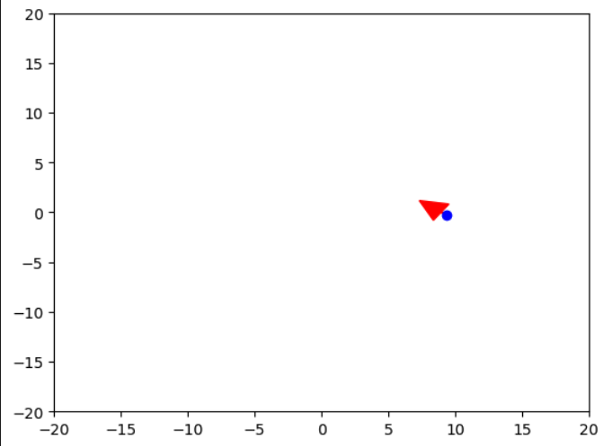

> **Disclaimer:** This tutorial is part of a comprehensive series that I've created to guide you through the process of building a spider robot. Each tutorial in the series is designed to cover a specific aspect of the project, providing detailed instructions and insights to help you understand and replicate the steps.
> 
> You can find the entire series [here](../README.md). I encourage you to explore all the tutorials in the series to gain a complete understanding of the project. Whether you're a beginner or an expert, I hope you find these resources helpful and informative. Happy building!

## Tutorial: Controlling a Robot with a HID Game Controller

In this tutorial, we will learn how to use the `GamepadController` class I wrote to interact with a game controller as a Human Interface Device (HID) and finally control your robot. 
The tutorial covers the following steps:

1. Listing all HID devices
2. Connecting to a HID device
3. Understanding the raw output from the controller and the two-value transmission per channel
4. Identifying controller channels and configuring them
5. Writing a method to control a robot using the game controller

## Resources

This repository includes a [Jupyter Notebook](forward_kinematics.ipynb) that contains the code and visualizations. 

### Step 1: Listing all HID devices

Before we can use a HID device, we need to know its vendor ID, product ID, or name. The `list_hid_devices()` method in the `GamepadController` class can be used to list all connected HID devices along with their vendor IDs, product IDs, and names:

```python
GamepadController.list_hid_devices()

```

This static method will list all the HID devices connected to your computer, showing their vendor and product IDs as well as their product strings (names).

### Step 2: Connecting to a HID device
Once we know the vendor ID, product ID, or name of our game controller, we can use the connect() method to establish a connection:

```python
gamepad = hid.device()
controller = GamepadController(gamepad)
controller.connect(vendor_id=<vendor_id>, product_id=<product_id>)  # Replace with actual IDs
# OR
controller.connect(name=<device_name>)  # Replace with actual name
```

This will connect to the HID device with the given vendor ID and product ID, or name.

### Step 3: Understanding the raw output from the controller and the two-value transmission per channel
To better understand the raw output data from the HID device, you can use the print_raw_data() method:
```python
GamepadController.print_raw_data(gamepad)
```
This method will print the raw data received from the controller. Understanding this data is crucial for interpreting the controller's inputs.

Typically, a single channel of a HID device transmits information using two values: a base value and a multiplier. These two values are combined to create a larger data range. In the GamepadController class, this is handled in the process_input() method:

```python
def process_input(self, input_data):
    for channel, index in self.channels.items():
        first_byte = input_data[index]
        multiplier = input_data[index + 1]
        value = 255 * multiplier + first_byte
        self.channel_states[channel] = value
```
The first_byte is the base value, and multiplier is used to increase the range of the possible values. The final value for the channel is calculated by multiplying the multiplier by 255 and adding the base value.

To identify which channels correspond to which controller inputs, you can experiment by moving different parts of your controller and observing the changes in the raw data output. This will help you identify which indexes correspond to which controller inputs.

### Step 4: Identifying controller channels and configuring them
The GamepadController class allows you to define channels such as throttle, roll, yaw, and pitch. After identifying the channels by observing the changes in raw data output during different controller inputs, you can define the channels as follows:

```python
controller = GamepadController(gamepad, channels={'throttle': 0, 'roll': 1, 'yaw': 2, 'pitch': 3})
```

Then you can use the read_controller() method to read the current state of the game controller:

```python
controller_state = controller.read_controller()
print(controller_state)
```

The read_controller() method returns a dictionary containing the current state of all the defined channels.

### Step 5: Writing a method to control a robot using the game controller
With the ability to read the state of the game controller, you can now use this information to control a robot. The following is a simple pseudocode example of how to do this:

```python
while True:
    # Read the controller state
    controller_state = controller.read_controller()
    
    # Get the state of the throttle and yaw channels
    throttle = controller_state.get('throttle')
    yaw = controller_state.get('yaw')
    
    # Use the throttle and yaw values to control the robot
    robot.move_forward(throttle)
    robot.turn(yaw)
    
    # Wait a short period of time before the next iteration
    time.sleep(0.1)
```


### Oh... Wait! What is HID?

HID stands for Human Interface Device. It's a type of computer device that interacts directly with, and most often takes input from, humans and may deliver output to humans. The term "HID" most commonly applies to the USB-HID specification. The USB-HID specification defines a device class (a type of computer hardware) that includes devices like keyboards, mice, game controllers, and even some more unusual devices like barcode readers.

HID devices are designed to be plug-and-play, which means that when you plug one of these devices into your computer, the operating system should automatically recognize it and load the appropriate drivers.

To identify a HID device, you can look for the following indicators:

1. Vendor ID and Product ID: Every USB device has a vendor ID and a product ID that uniquely identifies it. The vendor ID is a unique number assigned to the manufacturer by the USB standards group, and the product ID is chosen by the manufacturer and is unique to each product they make. You can see these IDs by inspecting the device's properties in your operating system's device manager, or by using software tools that list USB devices (like lsusb on Linux).
2. Device Class: The device class tells the operating system what type of device it is and how it should be handled. HID devices have a device class of 03.
3. Usage Page and Usage ID: The usage page and usage ID are part of the HID specification, and they tell the operating system what kind of input or output the device provides. For example, a mouse might have a usage page of 01 (Generic Desktop Controls) and a usage ID of 02 (Mouse).
4. In Python, you can use the hid library to interact with HID devices. You can list all HID devices connected to your computer using the hid.enumerate() function, which returns a list of dictionaries. Each dictionary contains information about one HID device, including its vendor ID, product ID, usage page, and usage ID.