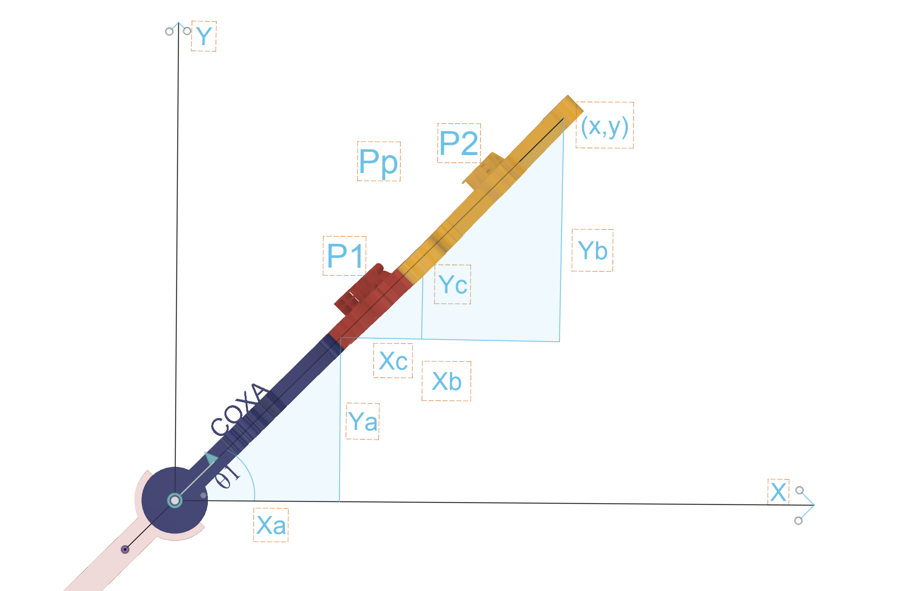
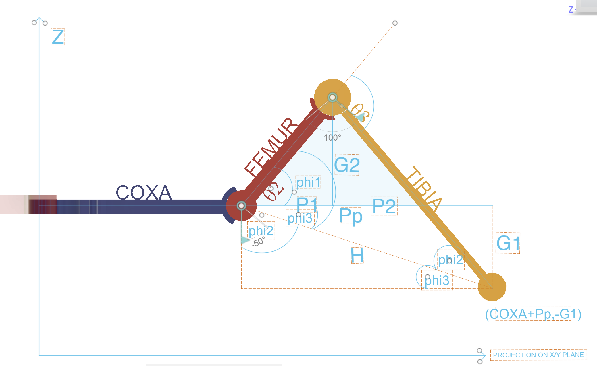
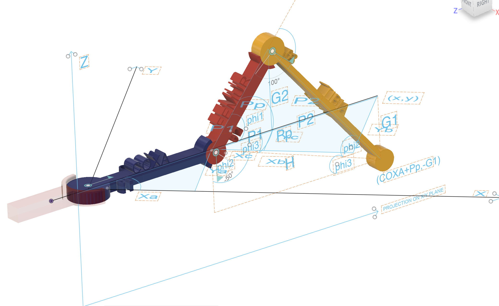

> **Disclaimer:** This tutorial is part of a comprehensive series that I've created to guide you through the process of building a spider robot. Each tutorial in the series is designed to cover a specific aspect of the project, providing detailed instructions and insights to help you understand and replicate the steps.
> 
> You can find the entire series [here](../README.md). I encourage you to explore all the tutorials in the series to gain a complete understanding of the project. Whether you're a beginner or an expert, I hope you find these resources helpful and informative. Happy building!

## Resources

This repository includes a [Jupyter Notebook](forward_kinematics.ipynb) that contains the code and visualizations. 

# Understanding the Forward Kinematics Method in a Spider Robot

Welcome, coding enthusiasts and aspiring roboticists! My goal is to document my journey of building a spider robot in the form of short but detailed tutorials. These tutorials will be easy for everyone to follow, packed with code examples and thorough explanations. Whether you're a seasoned coder or a beginner just starting out, I believe these guides will be a valuable resource in your learning journey. 

Today, in this installment of our exciting series on building a spider robot, we're going to delve into a vital aspect of robot motion planning - the forward kinematics method. Specifically, we'll be exploring the `forwardKinematicsNaive` method in our `SpiderLeg` class.

# Forward Kinematics in Robotics

Forward kinematics is a term in robotics that refers to the calculation of the end effector's position (for instance, a robot arm's or a leg's tip position) given the joint angles. It's essentially about predicting the pose of a robot given its joint parameters.

For a spider-like robot, which could be a quadruped (4-legged) or hexapod (6-legged) robot, forward kinematics would involve determining the position of each of its feet given the angles of its joints. Each leg of the robot is typically a kinematic chain, with joints that allow movements in specific directions.

In practical terms, forward kinematics allows the robot to plan its movements. If the robot's brain decides to move a specific leg to a certain position, it can use inverse kinematics to calculate the necessary joint angles, then move the joints to those angles, and use forward kinematics to check that the leg ended up in the right place.

## Brief Introduction to Trigonometry

Before we dive into the code, let's briefly touch upon some basic trigonometry concepts that are used in this method:

- **Sine (sin)**: In a right-angled triangle, the sine of an angle is the length of the side opposite to that angle divided by the length of the hypotenuse (the longest side, opposite the right angle). This is expressed as: \(\sin(\theta) = \frac{{\text{{opposite}}}}{{\text{{hypotenuse}}}}\).

- **Cosine (cos)**: Similarly, the cosine of an angle in a right-angled triangle is the length of the side adjacent to the angle divided by the length of the hypotenuse. This is expressed as: \(\cos(\theta) = \frac{{\text{{adjacent}}}}{{\text{{hypotenuse}}}}\).

- **Tangent (tan)**: The tangent of an angle is defined as the ratio of the sine to the cosine of that angle, or equivalently, the ratio of the side opposite the angle to the side adjacent to the angle in a right-angled triangle. This is expressed as: \(\tan(\theta) = \frac{{\sin(\theta)}}{{\cos(\theta)}}\).

- **Pythagorean theorem**: In any right-angled triangle, the square of the length of the hypotenuse (the side opposite the right angle) is equal to the sum of the squares of the lengths of the other two sides. This can be written as \(a^2 + b^2 = c^2\), where \(c\) is the length of the hypotenuse, and \(a\) and \(b\) are the lengths of the other two sides.

These concepts allow us to calculate the lengths of sides in a right triangle when an angle is known, or to find an angle when the lengths of the sides are known. They form the basis for many geometric calculations and transformations, including those used in our forward kinematics.

Let's get started!

# The `forward_kinematics_naive` Method: A Deep Dive

In this tutorial, we'll dissect the `forward_kinematics_naive` method from the `SpiderLeg` class in our spider robot project. This method is pivotal for calculating the positions of the leg's joints based on the joint angles. Here's a detailed breakdown of each step, complete with trigonometry explanations and inline code snippets.




1. **Angle Conversion**:
   The method begins by converting the joint angles from degrees to radians. This conversion is essential as trigonometric functions in Python's math library require angles in radians.

   ```python
   theta1, theta2, theta3 = map(math.radians, self.get_angles())
   ```

2. **Coxa-Femur Joint Calculation**:
   - `Xa` and `Ya` determine the x and y coordinates of the coxa-femur joint (the hip joint). They are calculated using the cosine and sine of `theta1`, respectively, multiplied by the length of the coxa (`self.COXA`). Cosine gives the horizontal component, and sine provides the vertical component.

     ```python
     Xa = self.COXA * math.cos(theta1)
     Ya = self.COXA * math.sin(theta1)
     ```

3. **Femur Segment Calculations**:
   - The vertical component `G2` of the femur length is calculated by the femur length (`self.FEMUR`) multiplied by the sine of `theta2`. This gives the vertical displacement.
   - The horizontal component `P1` is found by multiplying the femur length by the cosine of `theta2`. This gives the horizontal displacement.

     ```python
     G2 = math.sin(theta2) * self.FEMUR
     P1 = math.cos(theta2) * self.FEMUR
     ```

4. **Femur-Tibia Joint Calculation**:
   - `Xc` and `Yc` are the x and y coordinates of the femur-tibia joint (knee joint), computed by multiplying `P1` with the cosine and sine of `theta1`.

     ```python
     Xc = math.cos(theta1) * P1
     Yc = math.sin(theta1) * P1
     ```

5. **Tibia-Tip Joint Calculation**:
   - This step involves calculating the position of the tibia-tip joint (foot of the leg) using a series of trigonometric calculations.
   - `H` is the straight-line distance from the femur-tibia joint to the tibia-tip joint, calculated using the Law of Cosines.

     ```python
     H = math.sqrt(self.TIBIA**2 + self.FEMUR**2 - 2*self.TIBIA*self.FEMUR*math.cos(math.radians(180) - theta3))
     ```

   - `phi1` is calculated using the Law of Cosines again, to find the angle at the femur-tibia joint.

     ```python
     phi1 = math.acos((self.FEMUR**2 + H**2 - self.TIBIA**2) / (2*self.FEMUR*H))
     ```

   - `phi2` is the angle at the tibia-tip joint. It's calculated by subtracting `phi1` and the external angle \( 180^\circ - \theta3 \) from 180 degrees.
   - `phi3` is an auxiliary angle, used to find the horizontal and vertical projections. It's calculated by subtracting `theta2` from `phi1`.

     ```python
     phi2 = math.radians(180) - (math.radians(180) - theta3) - phi1
     phi3 = phi1 - theta2
     ```

   - `Pp` is the horizontal projection of the tibia-tip joint on the plane of the femur. It is calculated using the cosine of `phi3` multiplied by `H`.

     ```python
     Pp = math.cos(phi3) * H
     ```

   - `P2` is the horizontal distance between the femur-tibia joint and the tibia-tip joint. It is calculated as the difference between `Pp` and `P1`.

     ```
     P2 = Pp - P1
     ```

   - `Yb` and `Xb` are the x and y coordinates of the tibia-tip joint, calculated by multiplying the sine and cosine of `theta1` by `Pp`, respectively.

     ```python
     Yb = math.sin(theta1) * Pp
     Xb = math.cos(theta1) * Pp
     ```

   - `G1` is the vertical component (z-coordinate) of the tibia-tip joint. It is calculated using the sine of `phi3` multiplied by `H`. The result is negated as the z-axis might be defined downwards in the robot's coordinate system.

     ```python
     G1 = math.sin(phi3) * H
     G1 = -G1
     ```

6. **Joint Locations List**:
   - The method concludes by creating a list of joint locations. Each joint location is represented by a set of x, y, and z coordinates. This list includes the positions of the base joint, coxa-femur joint, femur-tibia joint, and the tip of the leg.

     ```python
     joint_locations = [
         [0, 0, 0],  # Base joint
         [Xa, Ya, 0],  # Coxa-femur joint
         [Xa + Xc, Ya + Yc, G2],  # Femur-tibia joint
         [Xa + Xb, Ya + Yb, G1]  # Tip of the leg
     ]
     ```


>Remember, the beauty of robotics lies not just in the final product, but in the intricate processes that bring the robot to life. Happy coding!