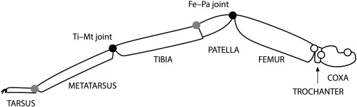
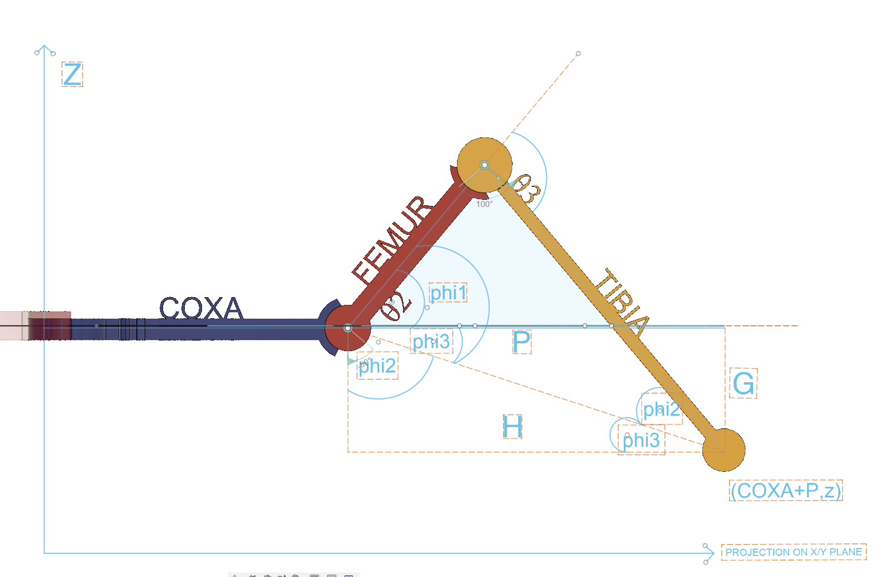

Today's enchanting adventure begins with exploring the secrets of Inverse Kinematics, where we'll learn how our spider robot will move its legs to traverse its surroundings gracefully.

This tutorial is part of a comprehensive series that I've created to guide you through the process of building a spider robot. Each tutorial in the series is designed to cover a specific aspect of the project, providing detailed instructions and insights to help you understand and replicate the steps.


In this tutorial, we'll learn how to write a `SpiderLeg` class to perform 
inverse kinematics calculations for a spider robot leg. 
Inverse kinematics is a method used in robotics to calculate 
the joint angles required to achieve a specific target position in the workspace. 
The opposite of inverse kinematics is forward kinematics, 
which calculates the position of the end effector (for example the tip of a robot arm or leg) given the joint angles.
In the case of our spider robot leg, we have three joints: the coxa (hip), femur (thigh), and tibia (shin). 
Each joint has an associated angle, which we'll call `theta1`, `theta2`, and `theta3`. Our goal is to determine the values of these angles that will place the leg's end effector (the foot) at a desired target position `(x, y, z)`.

```python
class SpiderLeg:
    def __init__(self, name, COXA, FEMUR, TIBIA):
        self.name = name
        self.COXA = COXA
        self.FEMUR = FEMUR
        self.TIBIA = TIBIA
        self.theta1 = 0.
        self.theta2 = 0.
        self.theta3 = 0.
        self.joints = self.forwardKinematics()

    def inverseKinematics(self, target=None):
        # Your inverse kinematics implementation here
        pass

    def forwardKinematics(self, angles=None):
        # Your forward kinematics implementation here
        pass
```

In the example above, we have defined a simplified SpiderLeg class that represents a single leg of a spider robot. The class includes the following elements:

The "init" method initializes the class with a name, segment lengths (COXA, FEMUR, and TIBIA), and initial joint angles (theta1, theta2, and theta3). The forwardKinematics method is called to calculate the initial joint positions.

The inverseKinematics method is a placeholder for the actual implementation of inverse kinematics calculations. When given a target position, this method should compute the joint angles (theta1, theta2, and theta3) required to reach the target.

The forwardKinematics method is a placeholder for the actual implementation of forward kinematics calculations. When given a set of joint angles (theta1, theta2, and theta3), this method should calculate the resulting end-effector (foot) position in the 3D space.

This simplified structure provides a foundation for implementing the inverse and forward kinematics algorithms. You can extend the class by adding more functionality, such as methods to control the servos, update the joint angles, or visualize the leg movement.

Before we dive into the explanation of the spider leg model, it's important to note that the actual structure and movement of a spider leg in nature are far more complex than our simplified representation. In this tutorial, we are using a basic mechanical model with three segments and three joint angles to help us understand the fundamental concepts of leg movement and inverse kinematics. Keep in mind that real spider legs have more intricate joint structures, muscle systems, and movement patterns, and our model serves as an approximation for educational purposes. 

Please also note that the approach presented in this tutorial is a simplified, you could say naive method for solving inverse kinematics. In robotics and more advanced applications, there are more sophisticated methods used for inverse anf forward kinematics, such as the Denavit-Hartenberg (D-H) method, the Jacobian method, or the Cyclic Coordinate Descent (CCD) method. These methods offer more accurate and efficient ways to solve inverse kinematics, especially for more complex robotic systems. However, for the purpose of this tutorial and for a better understanding of the basic concepts, I have chosen a simplified approach. If you want to learn more about those advanced topics strongly advise you to follow up with lectures of Angela Sodemann. You will find links to her lectures in the video description.

First, let's delve into the fascinating geometry of a spider leg, comprising three primary segments: the coxa, femur, and tibia. Each joint's movement is governed by angles θ1, θ2, and θ3, which dictate the leg's horizontal rotation, vertical movement, and extension, respectively. Exploring different views, like the top and side perspectives, helps us understand how each joint angle affects the leg's orientation in the X-Y plane and its overall positioning. However, this is just scratching the surface of the spider leg's complex kinematics. For a more in-depth understanding and to see the intricate interplay of these angles and segments, I highly encourage you to visit our detailed tutorial on GitHub, where I break down the concepts further and provide a comprehensive guide to the sophisticated world of inverse kinematics.

Next, let's revisit fundamental trigonometric functions. Sine, cosine, and tangent are crucial for understanding the angles and sides of right-angled triangles. We also dissect the cosine rule, a pivotal principle that extends beyond right-angled triangles, helping us determine unknown sides and angles. These concepts are not just theoretical; they're the building blocks for calculating precise movements of our spider leg model. While these explanations provide a snapshot of the mathematical intricacies involved, I invite you to join me on GitHub for a comprehensive breakdown. There, I unpack these concepts further, ensuring you have a robust foundation to tackle the complexities of inverse kinematics.

I apologize for the lengthy introduction, but it's essential for understanding what's to come. Now, let's move on to the actual calculation process and dive into the practical side of inverse kinematics. Thank you for your patience; let's get started!


## Inverse Kinematics: Calculation Proces
In this tutorial, we use two sets of symbols: theta (θ) and phi (φ). 
Both symbols represent angles, but they have different roles in the context of our leg kinematics.

Now, let's begin the process by calculating the first angle, θ1, which determines the leg's horizontal orientation. 
We need to find the angle between the coxa and the X-axis. 
To do this, we can imagine a right-angled triangle formed by the X and Y axes and the coxa. 
The coxa connects the origin (0,0) to the point (x, y), with x and y representing the coordinates of the endpoint in the top view.

We need to find the angle between the X-axis and the coxa, which we can call θ1. 
To do this, we'll use the arctangent (atan) function, which is the inverse of the tangent function.

Recall that the tangent function (tan) is the ratio of the length of the opposite side to the length of the adjacent side in a right-angled triangle. 
In our case, the opposite side has a length of y, and the adjacent side has a length of x:
$$tan(\theta1)=\frac{y}{x}$$

To determine the actual angle, θ1, we use the arctangent function (often abbreviated as atan). This mathematical tool calculates the angle when you know the ratio of the opposite side's length to the adjacent side's length in a right-angled triangle. Essentially, it helps us figure out the steepness or incline angle based on the triangle's dimensions.
So, in our right-angled triangle with legs x and y, the atan(y/x) gives the angle θ1 between the X-axis and the coxa.
```python
theta1 = atan(y / x)
```
This calculation gives us the horizontal orientation of the leg, which is an essential first step in determining the joint angles for inverse kinematics.

Next, we'll calculate intermediate values needed for determining θ2 and θ3. 
We'll use the sine and cosine functions to find the lengths Xa and Ya, which are the projections of the coxa segment along the X and Y axes.
```python
Xa = COXA * cos((theta1))
Ya = COXA * sin((theta1))
```

Now, we'll find Xb and Yb, which are the remaining distances along the X and Y axes from the coxa segment to the target position:
```python
Xb = x - Xa
Yb = y - Ya
```
To find P, we can use the following relationship based on the cosine function for a right-angled triangle:
$$cos(\theta1) = \frac{adjacent}{hypotenuse}$$
In our case, the adjacent side is Xb, and the hypotenuse is P. 
Rearranging the equation, we get:
$$hypotenuse (P) = \frac{adjacent (Xb)}{cos(\theta1)}$$
Which we translate to python code that calculates the hypotenuse P, which is the horizontal distance from the end of the coxa to the target point in the horizontal plane.
```python
P = Xb / cos(theta1)
```

G is the absolute value of the z-coordinate of the target position. 
It represents the vertical distance between the coxa-femur joint and the target position along the z-axis.

We can imagine a right-angled triangle with P as the base (adjacent side), G as the height (opposite side), and H as the hypotenuse. In this triangle, the angle between the base (P) and the height (G) is a right angle (90 degrees).
The Pythagorean theorem states that in a right-angled triangle, the square of the length of the hypotenuse (the side opposite the right angle) is equal to the sum of the squares of the lengths of the other two sides. 

$$H^2 = P^2 + G^2$$
To find the length of H, we can take the square root of both sides of the equation.
$$H = sqrt(P^2 + G^2)$$
```python
G = abs(z)
H = sqrt(P ** 2 + G ** 2)
```

Next we'll use the arcsine (asin) function, which is the inverse of the sine function, to find the angle φ3. In a right-angled triangle with legs G and H, the arcsine G over H gives the angle between the side opposite the angle and the hypotenuse.

```python
phi3 = asin(G / H)
```
Now, we'll apply the cosine rule to find the angles φ1 and φ2. The cosine rule is a formula that relates the lengths of the sides of a triangle to the cosine of one of its angles:
$$c^2 = a^2 + b^2 - 2ab * cos(C)$$

We'll rearrange the formula to find the cosine of angle C.
$$cos(C) = (a^2 + b^2 - c^2) / (2ab)$$

In our case, for φ2, a = self.TIBIA, b = H, and c = self.FEMUR:

```python
phi2Acos = ((self.TIBIA ** 2) + (H ** 2) - (self.FEMUR ** 2)) / (2 * self.TIBIA * H)
phi2 = acos(phi2Acos)
```

For φ1, a = self.FEMUR, b = H, and c = self.TIBIA:

```python
phi1 = acos((self.FEMUR ** 2 + H ** 2 - self.TIBIA ** 2) / (2 * self.FEMUR * H))
```
With the φ1, φ2, and φ3 values calculated, we can now determine θ2 and θ3 based on these values and the sign of z. 

When the leg is lifted above the coxa (z is larger than 0)
In this case, the target position is above the coxa-femur joint along the z-axis. To reach this position, the leg needs to bend backward, which means theta2 should be positive. To calculate the correct value of theta2, we need to consider both phi1 and phi3. Since both angles are positive, we add them together:
theta2 = phi1 + phi3

**When the leg is lowered below the coxa (z ≤ 0):**
In this case, the target position is below the coxa-femur joint along the z-axis. To reach this position, the leg needs to bend forward, which means theta2 should be negative or smaller than phi1. To calculate the correct value of theta2, we need to consider the effect of phi3. Since phi3 is positive, we subtract it from phi1:
theta2 = phi1 - phi3

```python
if z > 0:
    theta2 = phi1 + phi3
else:
    theta2 = phi1 - phi3
```

Finally, we'll calculate θ3 as the sum of φ1 and φ2.

```python
theta3 = phi1 + phi2
```

With the angles θ1, θ2, and θ3 calculated, we can update the joint angles.

```python
ang = [degrees(theta1), degrees(theta2), degrees(theta3)]
self.setAngles(ang)
return ang
```

To summarize, we've used trigonometric functions such as sine, cosine, and tangent, as well as the cosine rule, to calculate the joint angles required for our spider leg model to reach a specific target position. By understanding the relationships between the lengths and angles in right-angled triangles, we've been able to apply these principles to a more complex, three-dimensional problem.

## Ending word
And there you have it, everyone! I really enjoyed creating this video for you, and I hope it has helped you understand the workings of a simplified spider leg model and the trigonometry behind it. 
I'm always looking forward to hearing your thoughts, so if you found this video helpful or have any suggestions for what you'd like me to cover next, please leave a comment below. Your feedback will help me create better content for you in the future. 
Remember to like this video, share it with your friends, and subscribe to my channel for more educational content like this. Thanks for watching, and until next time, happy learning!
