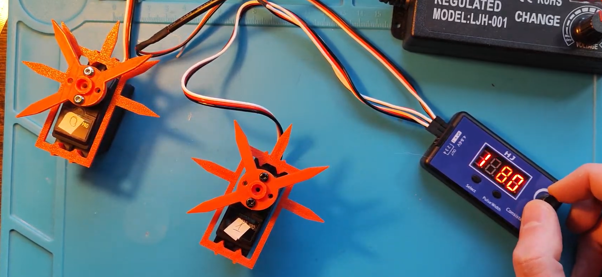
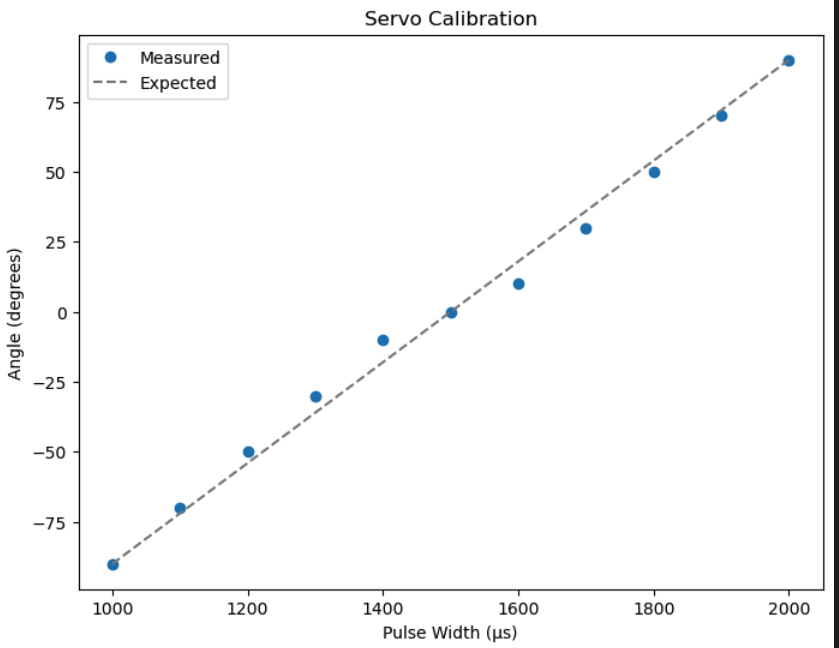

> **Disclaimer:** This tutorial is part of a comprehensive series that I've created to guide you through the process of building a spider robot. Each tutorial in the series is designed to cover a specific aspect of the project, providing detailed instructions and insights to help you understand and replicate the steps.
> 
> You can find the entire series [here](../README.md). I encourage you to explore all the tutorials in the series to gain a complete understanding of the project. Whether you're a beginner or an expert, I hope you find these resources helpful and informative. Happy building!


# Servo Calibration with a Servo Tester

This tutorial guides you through the process of calibrating a servo using a servo tester. 

## Requirements

1. A servo motor
2. A servo tester
3. A power supply or batteries appropriate for your servo tester
4. A 3D model for precise calibration (optional)


## Resources

This repository includes a [Jupyter Notebook](servo_calibration.ipynb) that contains the code and visualizations. 

### 3D Model for Precise Calibration

To make the calibration process easier and more precise, I have prepared a 3D model specifically designed for popular servo sizes. This model includes template angles at -90, -45, 0, 45, and 90 degrees, as well as a gauge that you can place on the moving outer shaft of the servo.



By lining up the gauge with the template angles, you can get exact pulse width readings for those specific angles. This not only simplifies the process but also ensures that you achieve an accurate and consistent calibration across different servos. 
**You can download and 3D print this model [here](https://www.thingiverse.com/thing:6191213).**

## Steps

1. **Connect Servo to Servo Tester:** Plug the servo connector into the servo tester. The order usually is Signal-Positive-Negative (orange or white or yellow - red - black or brown).

2. **Power up the Servo Tester:** Connect your power supply or battery to the servo tester. Ensure you use the right voltage and current rating for your servo.

3. **Calibration and Testing:**
   - **Neutral Position:** Set the pulse width to 1500 μs (or any value suggested by the manufacturer) using the tester. This should move the servo to the 0 degree position.
   - **Negative and Positive 90 Degrees:** Slowly decrease the pulse width from 1500 μs until the servo moves to what you want to consider as -90 degrees. Note down the pulse width at this point. Then, increase the pulse width from 1500 μs until the servo reaches +90 degrees and note down the pulse width.
   - **Full Range:** By alternating the pulse width from minimum (for -90 degrees) to maximum (for +90 degrees), you can see the full range of motion of the servo. 
## Configuration File for the Spider Robot

The configuration file for the spider robot is a JSON file that includes essential data for the robot operation. It contains detailed information about the robot's dimensions, leg specifications, controller, and servo configurations.

```json
{
    "dimensions":[17.6,13.2,0],
    "legs":[
        {"size":[4.35,8.0,19.8],"position":[8.8, -6.6, 0],"rotation": [-45,0,180]},
        {"size":[4.35,8.0,19.8],"position":[8.8, 6.6, 0],"rotation": [45,0,180]},
        {"size":[4.35,8.0,19.8],"position":[-8.8, -6.6, 0],"rotation": [-135,0,180]},
        {"size":[4.35,8.0,19.8],"position":[-8.8, 6.6, 0],"rotation": [135,0,180]}
    ],
    "controller":{
        "port":"/dev/tty.usbmodem14201"
    },
    "servos": [
        {
            "pin": 0,
            "angle_range": [-90, 90],
            "reverse": true,
            "calibration_data": [1028, 1997, -45, 45],
            "offset":0
        },
        {
            "pin": 1,
            "angle_range": [-100, 110],
            "reverse": true,
            "calibration_data": [914,2210 , -90, 90],
            "offset":2
        },
        {"rest of servos e.g. pin 2-9 servos go ":"here"},
        {
            "pin": 10,
            "angle_range": [-100, 110],
            "reverse": false,
            "calibration_data": [867, 2155, -90, 90],
            "offset":6
        },
        {
            "pin": 11,
            "angle_range": [-70, 175],
            "reverse": false,
            "calibration_data": [814,2127 , -90, 90],
            "offset":72
        }
    ]
}


```

The `servos` key is an array that contains detailed configuration for each servo motor used in the robot. The servos are identified by their `pin` numbers. The `angle_range` key holds the minimum and maximum angles the servo can rotate. The `reverse` key specifies if the direction of the servo needs to be reversed.

The `calibration_data` is the critical aspect for our tutorial. It's an array of four values: the minimum and maximum PWM signals that correspond to the minimum and maximum angles defined in `angle_range`. These values are crucial for mapping PWM signals to specific angles, which we'll use later to control the servos accurately. 

The `offset` key holds the value of the deviation from the zero position, which can be added or subtracted to adjust the servo's zero position due to mechanical misalignments.

By properly setting up this configuration file, we can precisely control the robot's movements, ensuring that each part works in unison to achieve the desired behavior.

## Important note: Relationship between pulse width and servo angle

For visualizing the relationship between pulse width and servo angle, a Python script can be found [in this Jupyter notebook](servo_calibration.ipynb).

The notebook will plot the measured pulse widths (x-axis) and corresponding angles (y-axis). The plot will have two lines:

- The blue line represents the actual measured positions.
- The gray dashed line represents an approximation.

A "linear approximation" is a simplified representation of data that assumes the relationship between two variables can be represented by a straight line. The concept comes from the field of mathematics, where it's often useful to approximate complex functions with simpler ones.

In the context of a servo motor, we often assume the relationship between pulse width (input) and the angle of the servo arm (output) is linear. This means we expect the servo arm to move at a constant rate as we increase the pulse width. For example, if increasing the pulse width by 100 µs causes the servo arm to move by 10 degrees, we expect that increasing the pulse width by 200 µs will move the servo arm by 20 degrees, and so on.

However, this relationship isn't always perfectly linear in real servos. Mechanical imperfections, non-linear electronics, or other factors may cause the servo to deviate from the expected linear behavior. That's why it's helpful to measure the actual response of the servo and compare it to the linear "perfect" approximation.

Here's what's being plotted in the previous code:


The pulse_widths and angles lists represent the actual measured response of the servo. The plt.plot(pulse_widths, angles, marker='o') line plots these values as blue dots on the graph.

The pulse_width_range and angle_range lists represent the expected linear response of the servo, based on the assumption that the servo moves 90 degrees when the pulse width changes by 400 µs. The plt.plot(pulse_width_range, angle_range, '--', color='gray') line plots this expected response as a dashed gray line on the graph.

By comparing the actual response to the expected linear response, you can see how much your servo deviates from the expected behavior. If the blue dots fall on the gray line, your servo behaves exactly as expected. If the blue dots deviate from the gray line, it means your servo doesn't move at a constant rate, and you might need to take this into account in your project.
